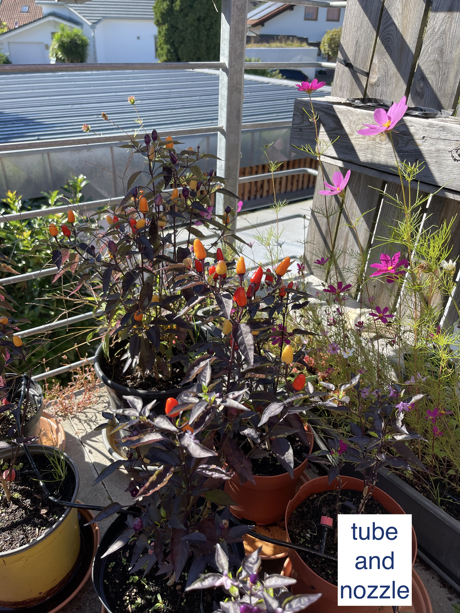

# IOT balkony-watering-system

## Introduction
You would like to have a green oasis on your balkony but you are tired of carrying heavy watering cans every day? Than here's your solution - simply bring your flowers into the world of the internet of things! I built a watering system around a ESP32 microcontroller which is now watering our plants automatically. All you need is your smartphone for setting up the system and controlling it. The rest is done by a pump floating in a water barrol, some valves, some tube and a bunch of nozzles.
<!---->

In the current status of the project the system can automatically water up to 4 strands independently. I created a web interface with which you can connect to the uC via wifi and adjust your system just right for your plants needs. 
Future features which are not yet realized include a soil moisture sensor which e.g. can detect if it was raining and the plants don't need to be watered.

## Hardware

The pump drives the atering system and its outlet is connected to a valve. 

## Electronics

The system is built around an ESP32. It is a powerful uC with integrated wifi connectivity. Its big advantage is, that it can be programmed using the Arduino IDE. The system is supplied by a standard 12V power supply. A DCDC converter provides 5V for the ESP32. I integrated a fuse and some capacitors to stabilize the supply voltage.
Both the pump and the valves arew operated at 12V. They are controlled by the ESP via MOSFETs. 

